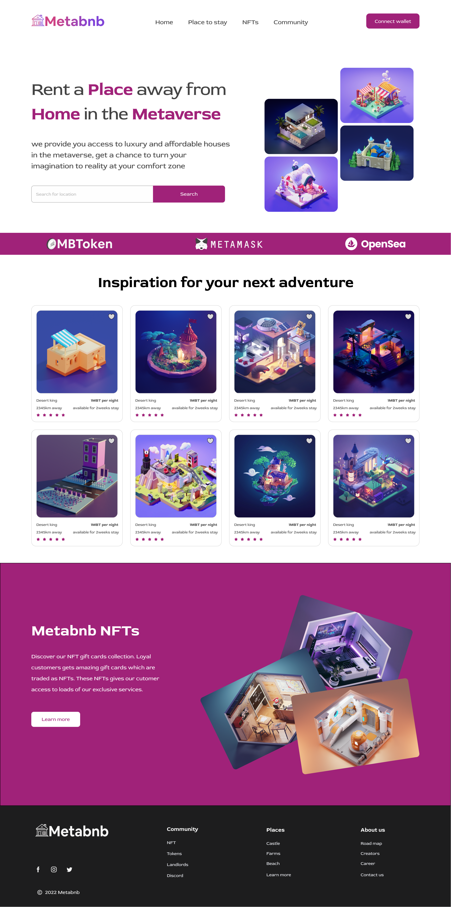

# Metabnb
### Metabnb provide you access to luxury and affordable houses in the metaverse


## Clone the repository using the command below :

```bash
git clone https://github.com/patoski716/metabnb-hng-stage-3.git

```

## Move into the directory where we have the project files : 

```bash
cd metabnb-hng-stage-3

```

## Project setup
```
npm install
```

### Compiles and hot-reloads for development
```
npm start
```

### Compiles and minifies for production
```
npm run build
```
### App preview

<div align="center">



</div>